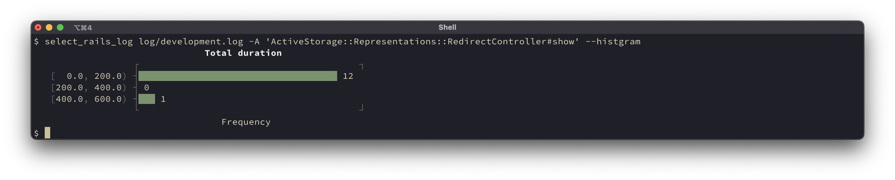
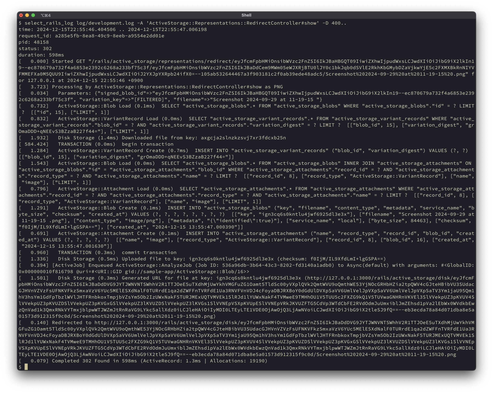

# select_rails_log

select_rails_log is a tool for parsing Rails log files and extracting request logs based on a variety of criteria.
These criteria include controller/action names, request date and time, response duration, and more.

The tool allows you to output the extracted logs in various formats and provides summary metrics such as percentiles and histograms.
It is particularly useful during development for identifying application bottlenecks or conducting small-scale benchmarking.

## Features

### Extraction Criteria

You can specify the following criteria to extract request logs:

* Request-ID
* Controller name and action name
* HTTP method and status code
* Date and time range of the request
* Response time range
* String matching within logs

### Output Formats

Extracted logs can be output in the following formats:

* Text
* JSON, JSONL
* TSV
* Raw log

Summarization Options

The tool supports the following summarization features:

* Percentiles by controller and action
* Box plots by controller and action
* Histograms for the overall extraction results

## Installation

Install the gem by executing:

```bash
gem install select_rails_log
```

## Usage

select_rails_log can process logs that include timestamps and Request-IDs.

To enable this, first configure the appropriate settings file, such as `config/environments/development.rb`, as follows:

```ruby
config.log_tags = [:request_id]
config.log_formatter = ::Logger::Formatter.new
```

### Sample session

Here are some usage examples.

To output a box plot for an overview, use the following command:

```bash
select_rails_log log/development.log --boxplot
```

The result will be output as follows:


Next, let’s examine the response time distribution for ActiveStorage::Representations::RedirectController#show, which had significant variance:

```bash
select_rails_log log/development.log -A 'ActiveStorage::Representations::RedirectController#show' --histgram
```


Finally, let’s take a closer look at requests that took particularly long, specifically those over 400ms:

```bash
select_rails_log log/development.log -A 'ActiveStorage::Representations::RedirectController#show' -D 400..
```



## Development

After checking out the repo, run `bin/setup` to install dependencies. Then, run `rake test-unit` to run the tests. You can also run `bin/console` for an interactive prompt that will allow you to experiment.

To install this gem onto your local machine, run `bundle exec rake install`. To release a new version, update the version number in `version.rb`, and then run `bundle exec rake release`, which will create a git tag for the version, push git commits and the created tag, and push the `.gem` file to [rubygems.org](https://rubygems.org).

## Contributing

Bug reports and pull requests are welcome on GitHub at https://github.com/arika/select_rails_log. This project is intended to be a safe, welcoming space for collaboration, and contributors are expected to adhere to the [code of conduct](https://github.com/arika/select_rails_log/blob/master/CODE_OF_CONDUCT.md).

## License

The gem is available as open source under the terms of the [MIT License](https://opensource.org/licenses/MIT).

## Code of Conduct

Everyone interacting in the SelectRailsLog project's codebases, issue trackers, chat rooms and mailing lists is expected to follow the [code of conduct](https://github.com/arika/select_rails_log/blob/master/CODE_OF_CONDUCT.md).
