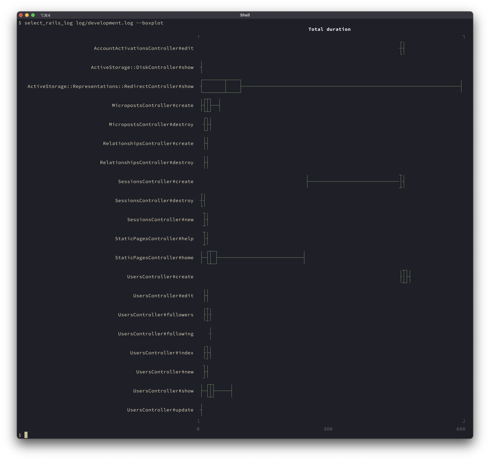

# select_rails_log

select_rails_log is a tool for extracting request logs from Rails log files.

It can be used during development to identify bottlenecks in the application or for small-scale benchmarking.

The following extraction criteria can be specified:

* Request ID
* Controller name and action name
* HTTP method and status code
* Request date and time range
* Response time range
* String matching

The extracted logs can be formatted and output in the following formats:

* Text
* JSON, JSONL
* TSV
* Raw log

Additionally, the tool can aggregate and output metrics such as response times for the extracted requests:

* Percentiles by controller and action
* Box plots by controller and action
* Histograms for the overall extraction results

## Installation

Install the gem by executing:

```bash
gem install select_rails_log
```

## Usage

select_rails_log can process logs that include timestamps and Request-IDs.

To enable this, first configure the appropriate settings file, such as `config/environments/development.rb`, as follows:

```ruby
config.log_tags = [:request_id]
config.log_formatter = ::Logger::Formatter.new
```

### Sample session

Here are some usage examples.

To output a box plot for an overview, use the following command:

```bash
select_rails_log log/development.log --boxplot
```

The result will be output as follows:



Next, let’s examine the response time distribution for ActiveStorage::Representations::RedirectController#show, which had significant variance:

```bash
select_rails_log log/development.log -A 'ActiveStorage::Representations::RedirectController#show' --histgram
```


Finally, let’s take a closer look at requests that took particularly long, specifically those over 400ms:

```bash
select_rails_log log/development.log -A 'ActiveStorage::Representations::RedirectController#show' -D 400..
```


## Development

After checking out the repo, run `bin/setup` to install dependencies. Then, run `rake test-unit` to run the tests. You can also run `bin/console` for an interactive prompt that will allow you to experiment.

To install this gem onto your local machine, run `bundle exec rake install`. To release a new version, update the version number in `version.rb`, and then run `bundle exec rake release`, which will create a git tag for the version, push git commits and the created tag, and push the `.gem` file to [rubygems.org](https://rubygems.org).

## Contributing

Bug reports and pull requests are welcome on GitHub at https://github.com/arika/select_rails_log. This project is intended to be a safe, welcoming space for collaboration, and contributors are expected to adhere to the [code of conduct](https://github.com/arika/select_rails_log/blob/master/CODE_OF_CONDUCT.md).

## License

The gem is available as open source under the terms of the [MIT License](https://opensource.org/licenses/MIT).

## Code of Conduct

Everyone interacting in the SelectRailsLog project's codebases, issue trackers, chat rooms and mailing lists is expected to follow the [code of conduct](https://github.com/arika/select_rails_log/blob/master/CODE_OF_CONDUCT.md).
